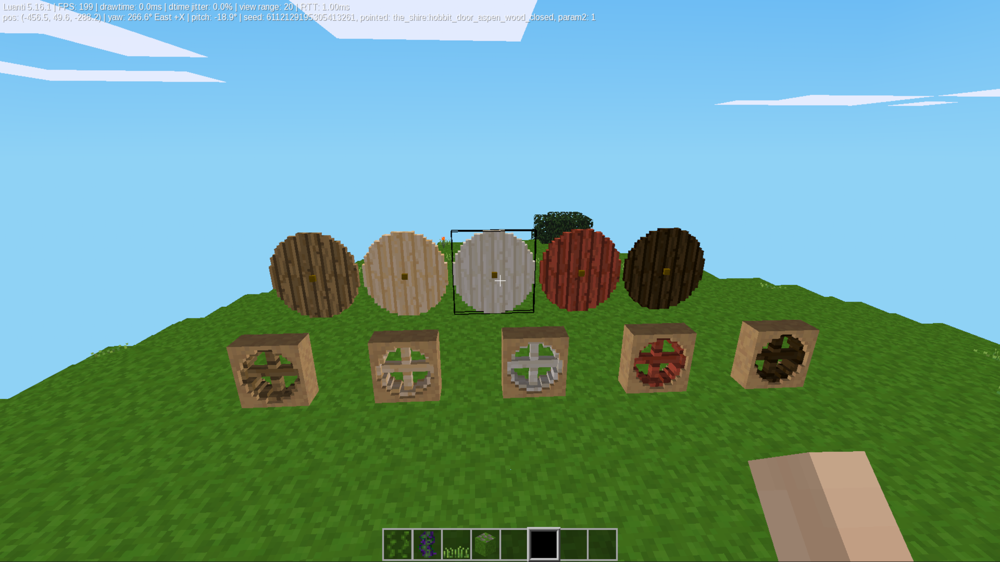
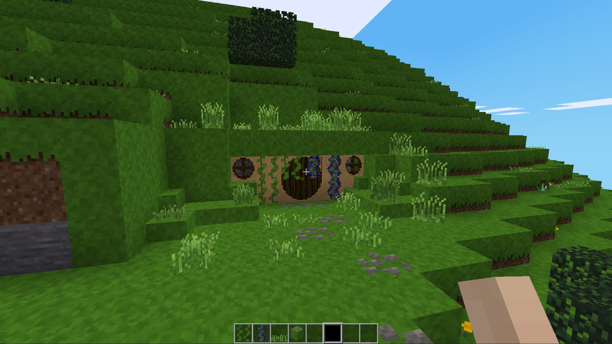

# The Shire Mod

This mod adds simple hobbit-themed decorations and structures to your Minetest or Luanti game, including round doors, stone windows, and green grass blocks. It works automatically with your existing game features and any custom texture packs you use.

---

## What This Mod Adds

### Round Doors and Windows
* **Working Doors:** Large round hobbit doors that move smoothly through three stages (Closed, Half-Open, Open) when right-clicked.
* **Safe and Secure:** Doors remember who placed them and can be locked so only you can get inside.
* **Stone Windows:** Round windows built into stone frames that let natural light shine straight through into your rooms.

### Keys and Locking
* **Lock and Key:** Adds a simple craftable door key item that you can carry in your pocket.
* **Clear Feedback:** Right-clicking a door with your key instantly locks or unlocks it and sends a text message to your chat box so you know it worked.

### Paths and Green Landscaping
* **All-Sided Grass Blocks:** Special blocks that have green grass textures on the top, bottom, and all four sides so they look good on hills and cliffs.
* **Grass Stairs and Slabs:** Half-blocks and steps fully covered in grass that blend perfectly into the hillsides.
* **Grass 1 - 5:** Small wild grass tufts that you can plant on top of grass slabs without any ugly floating gaps.
* **Stone Path Blocks:** Green grass blocks with flat walking stones embedded on top. You can rotate them when placing them down to build natural-looking walking paths.

---

## How to Install

1. Drop the `the_shire` folder inside the `mods` folder of your game or world directory.
2. Make sure the folder is named exactly `the_shire`.
3. Start your game, go to your world settings, click **Configure Mods**, and check the box to turn on `the_shire`.

---

---

## Legal Disclaimer and Trademark Notice

This project is an unofficial, non-profit, fan-made mod creation.

"The Hobbit", "The Lord of the Rings", and the names of characters, items, and settings therein are registered trademarks or copyrights of Middle-earth Enterprises and/or the Tolkien Estate.

This mod claims no ownership over these intellectual properties, receives no financial compensation, and is developed purely for educational and community entertainment purposes under fair use fan guidelines.

